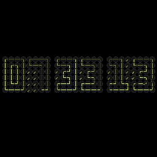

# Clock Made of Clocks (Recreation)

My recreation of u/EntropyReversed's CodePen called "Clock Made of Clocks".

This repo contains two implementations in Rust and Javascript (supports 
browser and Wallpaper Engine).

Steam Workshop: https://steamcommunity.com/sharedfiles/filedetails/?id=3604124423

Original Reddit post: https://www.reddit.com/r/webdev/comments/1nrx5n9/clock_made_of_clocks/

Original Pen: https://codepen.io/EntropyReversed/pen/QwybYEJ

Inspired by: https://github.com/githyperplexed/clock-of-clocks/
